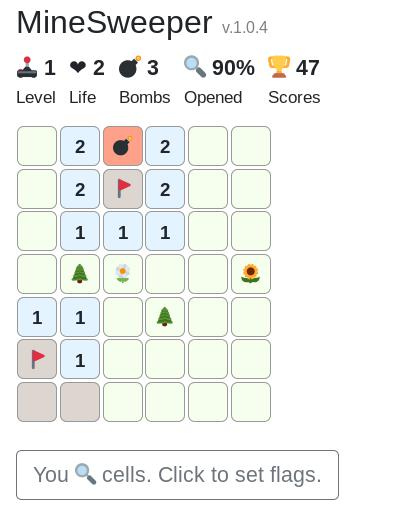

# MineSweeper

### What is it?
Minesweeper is a clone of one of the most popular classic games fully written on react.js.

### I'd like to play, how to use?
* Manual
1. Clone repo and run `yarn install` (or `npm install`) to download dependencies.
2. Run `npm run build` to build the game. The result files will be located in `/dist` directory in the root.
3. Go to the project root, run webpack hot web server `npm run start` or start express nodejs server `node server.js`
* Docker
1. Clone repo.
2. Build an image and run docker container or use docker-compose (notice, config yml file uses v3.6 and was tested with docker 18.02.0+)

###### Notice
_Game uses
[animate.css](https://github.com/daneden/animate.css)
and 
[bootstrap4](https://github.com/twbs/bootstrap)
via a CDN._